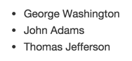

<p align="center"> 

<h1 align="center"> HTML </h1>

HTML (HyperText Markup Language) é uma **linguagem de marcação de hipertexto** utilizada para criar páginas da web (não é uma linguagem de programação). Ela fornece a descrição da estruturação da página através de textos no documento, denotando conteúdos como títulos, parágrafos, listas, links, imagens e entre outros.

> *Hipertexto são links que conectam páginas da web entre si.*

---

## TAGS

As tags são os componentes que formam o esqueleto e que definem a hierarquia dos elementos de um documento HTML. Cada tag geralmente consiste em um código com o sistema de abertura e fechamento, como `<tag>` e `</tag>`. Além disso, podemos incluir atributos adicionais para fornecer mais informações sobre o elemento. 
Por exemplo:

```html
<tag attribute="value">Content</tag>
```

Algumas tags comuns incluem:

```html
<p> → Define um parágrafo
<br> → Adiciona uma quebra de linha
 → Insere uma imagem
<div> → Define uma divisão ou seção em um documento
<a> → Define um link para outro documento ou para uma localização em um mesmo documento
```
#### ÊNFASE EM TEXTO
```html
<i> → itálico
<b> → negrito
<em> → itálico semântico
<strong> → negrito semântico
```

#### LISTAS
> **ordenadas:** enumera os elementos da lista.
```html
<ol>
  <li> George Washington </li>
  <li> John Adams </li>
  <li> Thomas Jefferson </li>
</ol>
```


> **não ordenadas:** coloca marcadores antes de cada elemento.
```html
<ul>
  <li> James Madison </li>
  <li> James Monroe </li>
  <li> John Quincy Adams </li>
</ul>
```


Há muitas outras tags disponíveis em HTML, cada uma com um propósito específico. Quando um navegador da web lê um documento HTML, ele interpreta as tags para exibir o conteúdo da página da web de maneira apropriada.

---

#### Exemplo de uma página HTML básica:

```html
<!DOCTYPE html>
<html>
  <head>
    <title>My Website</title>
  </head>
  <body>
    <h1>Welcome to my website!</h1>
    <p>Here you will find all sorts of interesting <b>information about me</b> and <b>my hobbies</b>.</p>
    <ul>
      <li>Hiking</li>
      <li>Cooking</li>
      <li>Reading</li>
    </ul>
    <p>Check out my <a href="/blog">blog</a> for more updates.</p>
  </body>
</html>
```

Este código cria uma página com um título "Welcome to my website!", um parágrafo de introdução e uma lista não ordenada de itens, além de um link para um blog. Quando essa página é carregada em um navegador da web, o conteúdo será exibido de acordo com as tags HTML.
