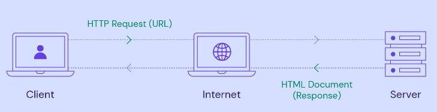

# 
 HTTP

HTTP (Hypertext Transfer Protocol) é um **protocolo de transferência de comunicação entre um navegador e um servidor web**. Este protocolo funciona através de um modelo **cliente-servidor**, onde um navegador (cliente) estabelece a comunicação com um servidor, fazendo a troca de informações entre eles. Depois que a solicitação é atendida por um servidor, a conexão entre o cliente e o servidor é desconectada.

Todas as mensagens enviadas pelo protocolo através de uma interface (site ou página que geralmente utiliza HTML) são localizadas na rede através das URLs. Uma nova conexão deve ser feita para cada solicitação, isto é, cada vez que alguém acessa o seu site. 

## Peer-to-Peer

O peer-to-peer é um sistema para compartilhamento de arquivos, documentos e informações  sem a necessidade de um servidor central. 

A tradução de peer-to-peer é "ponto a ponto", ou seja, significa que os computadores dos usuários, que são os "pontos", conectam-se entre si formando uma rede descentralizada.

## HTTPS

O HTTPS (Hyper Text Transfer Protocol Secure) utiliza o HTTP como base, porém utiliza uma camada de proteção na transmissão de dados, garantindo assim a criptografia da comunicação entre o PC e os servidores.

## Certificado Digital
O certificado SSL protege informações importantes dos usuários que navegam em sites em que ele está instalado. Para fazer isso, o recurso criptografa as informações dos visitantes, impossibilitando que elas sejam capturadas, interceptadas ou visualizadas durante a transferência até o servidor que hospeda o site.

## Request e Response
A mensagem enviada pelo cliente é chamada de solicitação (request), enquanto a mensagem enviada pelo servidor é chamada de resposta (response).

## O que é GET e POST?
São métodos HTTP. Eles indicam para o servidor qual a ação que o cliente deseja realizar. Quando realizamos uma requisição obrigatoriamente precisamos informar um método.

### GET
É usado quando o cliente deseja obter recursos do servidor.

### POST 
É usado quando o cliente deseja enviar dados para processamento ao servidor, por exemplo como os dados de um formulário.