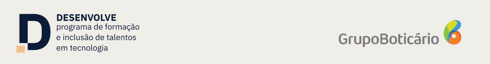

# 
Programa Desenvolve

📚 *repositório para projetos desenvolvidos no Programa Desenvolve 2023 - Alura Include*

---

**📅 TRILHA FULLSTACK:**
* [Semana 1](/Semana-01-10/Semana-1/semana1.md)
* [Semana 2](/Semana-01-10/Semana-2/semana2.md)
* [Semana 3](/Semana-01-10/Semana-3/semana3.md)
* [Semana 4](/Semana-01-10/Semana-4/semana4.md)
* [Semana 5](/Semana-01-10/Semana-5/semana5.md)
* [Semana 6](/Semana-01-10/Semana-6/semana6.md)
* [Semana 7](/Semana-01-10/Semana-7/semana7.md)
* [Semana 8](/Semana-01-10/Semana-8/semana8.md)
* [Semana 9](/Semana-01-10/Semana-9/semana9.md)
* [Semana 10](/Semana-01-10/Semana-10/semana10.md)
* [Semana 11](/Semana-11-20/Semana-11/semana11.md)
* [Semana 12](/Semana-11-20/Semana-12/semana12.md)
* [Semana 13](/Semana-11-20/Semana-13/semana13.md)
* [Semana 14](/Semana-11-20/Semana-14/semana14.md)
* [Semana 15](/Semana-11-20/Semana-15/semana15.md)
* *loading...*

**👥 PROJETO EM GRUPO**
* [Creche Batatinha](https://github.com/yayaflc/creche-batatinha)

**📝 ANOTAÇÕES:**
* [HTML](/Anota%C3%A7%C3%B5es/HTML/html.md)
* [CSS](/Anota%C3%A7%C3%B5es/CSS/CSS.md)
* [HTTP](/Anota%C3%A7%C3%B5es/HTTP/http.md)

**🔗 [LINKS ÚTEIS](/Links%20%C3%9Ateis/links_uteis.md)**